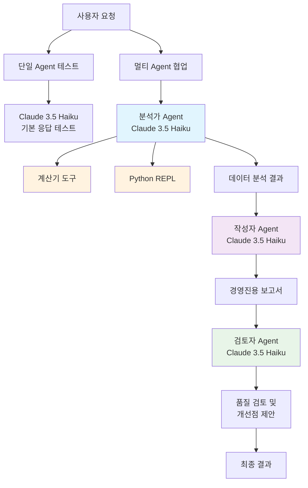
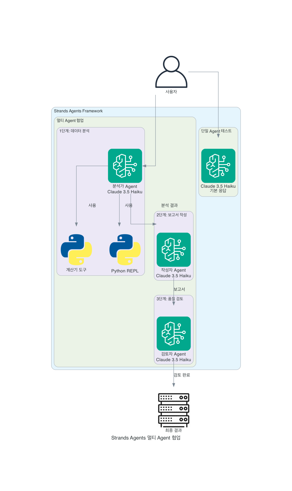

# Strands Agents Multi Agent Collaboration 샘플 코드

## 개요

**Strands Agents**는 Amazon에서 개발한 오픈소스 Python SDK로, AI 에이전트를 쉽게 구축할 수 있는 모델 중심 접근 방식을 제공합니다. Amazon Bedrock 모델과 AWS 인프라를 활용하여 지능형 에이전트를 최소한의 코드로 생성, 실행, 배포할 수 있습니다.

## Architecture Diagram





## 코드의 목적

이 테스트 코드는 Strands Agents의 다음 기능들을 검증합니다:
- 단일 Agent의 기본 동작 확인
- 멀티 Agent 협업 시나리오 테스트
- 도구(calculator, python_repl) 통합 기능 검증
- Amazon Bedrock Claude 3.5 Haiku Cross Inference 모델과의 연동 확인

## 설치

### 1. 패키지 설치
```bash
pip install strands-agents strands-agents-tools boto3
```

### 2. AWS 설정
```bash
# AWS 자격 증명 설정
aws configure

# 또는 환경 변수 설정
export AWS_ACCESS_KEY_ID=your_access_key
export AWS_SECRET_ACCESS_KEY=your_secret_key
export AWS_DEFAULT_REGION=us-west-2
```

### 3. Bedrock 모델 액세스 활성화
AWS 콘솔 > Amazon Bedrock > Model access에서 Claude 3.5 Haiku 모델 활성화

## 실행 방법

### 기본 버전 (대화형)
```bash
python multi_agent_test.py
```

### 자동화 버전 (무인 실행)
```bash
python auto_multi_agent_test.py
```

## 두 버전의 차이점

| 구분 | 기본 버전 | 자동화 버전 |
|------|-----------|-------------|
| **사용자 입력** | Python 코드 실행 시 승인 요청 | 자동 승인 |
| **도구 사용** | 계산기 + Python REPL | 계산기만 사용 |
| **안전 장치** | `Do you want to proceed? [y/*]` | 환경변수로 자동 승인 |
| **실행 방식** | 대화형 (사용자 개입 필요) | 무인 실행 (완전 자동화) |
| **분석 복잡도** | 고급 분석 (시각화, 통계) | 기본 계산 (평균, 합계) |
| **용도** | 개발/디버깅 시 안전한 테스트 | 자동화/CI/CD 파이프라인 |

## 테스트 시나리오

### 기본 버전 (multi_agent_test.py)

**1단계: 단일 Agent 테스트**
- 기본 Agent 생성 및 응답 확인

**2단계: 멀티 Agent 협업**
- **분석가 Agent**: 매출 데이터 분석 (계산기, Python REPL 도구 사용)
- **작성자 Agent**: 분석 결과를 경영진용 보고서로 작성
- **검토자 Agent**: 보고서 품질 검토 및 개선점 제안

### 자동화 버전 (auto_multi_agent_test.py)

**멀티 Agent 협업 (자동 실행)**
- **분석가 Agent**: 기본 계산 (평균, 총합, 증가율)
- **작성자 Agent**: 간단한 요약 보고서 작성
- **검토자 Agent**: 핵심 개선점 1-2개 제안

## 예상 실행 결과

```
=== 단일 Agent 기본 테스트 ===

안녕하세요. Strands AI 시스템이 정상적으로 작동하고 있습니다...

=== 단일 Agent 테스트 완료 ===

=== Strands Agents 멀티 Agent 협업 테스트 ===

1단계: 데이터 분석
분석 결과:
월별 매출: [100, 120, 150, 180, 200] 
월별 성장률 (%): [20.0, 25.0, 20.0, 11.11]
평균 매출: 150.00
...

2단계: 보고서 작성
보고서:
경영진 귀하
회사 A의 최근 영업 실적 분석 결과를 요약하여 보고 드리겠습니다...

3단계: 품질 검토
검토 결과:
보고서의 주요 내용은 잘 정리되어 있습니다. 다음과 같은 개선점을 제안합니다...

=== 멀티 Agent 협업 테스트 완료 ===
```

## 주요 특징

- **스트리밍 응답**: 실시간 응답 처리
- **도구 통합**: 계산기, Python REPL 등 다양한 도구 활용
- **멀티 Agent 워크플로우**: 여러 Agent가 순차적으로 협업
- **AWS Bedrock 연동**: Claude 3.5 Haiku Cross Inference 모델 활용

## 문제 해결

### 일반적인 오류
- **AWS 자격 증명 오류**: `aws configure` 실행 또는 환경 변수 설정
- **Bedrock 액세스 오류**: AWS 콘솔에서 모델 액세스 권한 확인
- **지역 경고**: 본인 Bedrock 호출 리전 (예: us-west-2 ) 확인

### 안전 장치 관련
- **`Do you want to proceed? [y/*]`**: Python 코드 실행 전 안전 확인
  - `y` 입력: 코드 실행 승인
  - `*` 또는 다른 키: 실행 거부
  - 자동화가 필요하면 `auto_multi_agent_test.py` 사용

- **scipy/라이브러리 오류**: Agent가 자동으로 대체 방법 사용 (정상 동작)


## 파일 구성

- `multi_agent_test.py`: 기본 테스트 코드 (대화형)
- `auto_multi_agent_test.py`: 자동화된 테스트 코드 (무인 실행)
- `requirements.txt`: 패키지 의존성
